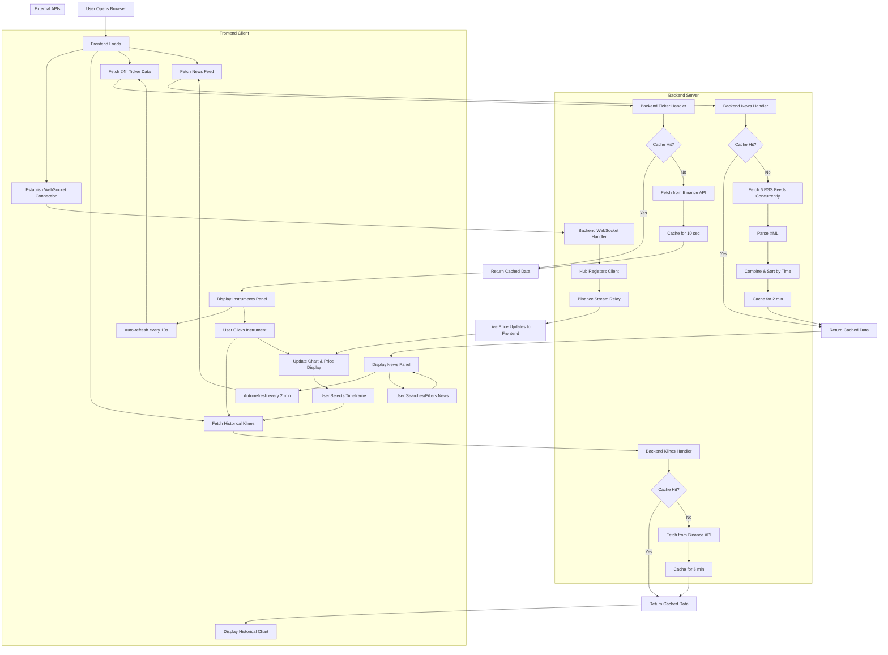

# Brokerage Platform

A real-time cryptocurrency and forex trading platform with live price updates, interactive charts, multi-source news aggregation, and market data visualization.

---

## Essential Commands

### Backend (Go)
```bash
# Navigate to server directory
cd cmd/server

# Run the server
go run main.go

# Build the server
go build

# Run tests
go test ./...
```

### Frontend (React + Vite)
```bash
# Navigate to frontend directory
cd frontend

# Install dependencies
pnpm install

# Start development server
pnpm run dev

# Build for production
pnpm run build

# Run linter
pnpm run lint

# Type checking
pnpm run typecheck
```

---

## Project Architecture

The application uses a **client-server architecture** with:
- **Backend**: Go server handling WebSocket connections, REST APIs, and external data integration
- **Frontend**: React SPA with real-time updates via WebSocket and REST API calls
- **Communication**: WebSocket for live price streaming, REST for historical data and news

```
┌─────────────┐         WebSocket/REST          ┌──────────────┐
│   Frontend  │ <─────────────────────────────> │   Backend    │
│   (React)   │                                 │   (Go)       │
└─────────────┘                                 └──────┬───────┘
                                                       │
                                    ┌──────────────────┼──────────────────┐
                                    ▼                  ▼                  ▼
                              Binance WS          Binance API         RSS Feeds
                              (Live Prices)       (Klines/Ticker)     (News)
```

---

## Project Structure

```
brokerageProject/
├── cmd/
│   └── server/
│       └── main.go                     # Application entry point
├── internal/
│   ├── api/
│   │   ├── handlers.go                 # HTTP/WebSocket handlers
│   │   ├── handlers_test.go            # API handler tests
│   │   └── middleware.go               # HTTP middleware
│   ├── binance/
│   │   ├── client.go                   # Binance WebSocket client
│   │   └── types.go                    # Binance data types
│   ├── config/
│   │   └── config.go                   # Configuration constants
│   ├── hub/
│   │   └── hub.go                      # WebSocket hub for broadcasting
│   ├── models/
│   │   └── models.go                   # Data models
│   ├── services/
│   │   └── market_data_service.go      # Market data business logic
│   └── utils/
│       ├── errors.go                   # Error handling utilities
│       └── json.go                     # JSON utilities
├── frontend/
│   ├── src/
│   │   ├── components/
│   │   │   ├── ChartComponent.tsx      # Candlestick chart
│   │   │   ├── Header.tsx              # Top header with theme toggle
│   │   │   ├── InstrumentsPanel.tsx    # Instruments list
│   │   │   ├── LivePriceDisplay.tsx    # Price display
│   │   │   ├── NewsPanel.tsx           # News feed
│   │   │   └── TradePanel.tsx          # Trading interface
│   │   ├── context/
│   │   │   └── WebSocketContext.tsx    # WebSocket context provider
│   │   ├── hooks/
│   │   │   └── useWebSocket.tsx        # WebSocket custom hook
│   │   ├── App.tsx                     # Main application component
│   │   ├── main.tsx                    # React entry point
│   │   └── index.css                   # Global styles
│   ├── index.html
│   ├── package.json
│   ├── tailwind.config.cjs
│   ├── tsconfig.json
│   └── vite.config.ts
├── docs/
│   ├── BACKEND.md
│   ├── FRONTEND.md
├── go.mod
└── README.md
```

---

## Tech Stack

### Backend
- **Language**: Go 1.25.3
- **WebSocket**: gorilla/websocket v1.5.3
- **Caching**: go-cache v2.1.0
- **HTTP Server**: net/http (standard library)
- **XML Parsing**: encoding/xml (standard library)

### Frontend
- **Framework**: React 18.2.0
- **Language**: TypeScript 5.9.3
- **Build Tool**: Vite 5.0.0
- **Styling**: Tailwind CSS 3.0.0
- **Charting**: lightweight-charts 4.0.0
- **Linting**: ESLint 8.48.0 with TypeScript plugins

### External APIs
- **Binance WebSocket**: Live trade data streaming
- **Binance REST API**: Historical klines and 24h ticker data
- **RSS Feeds**: 
  - Crypto: CoinDesk, CryptoNews, CoinTelegraph
  - Forex: FXStreet, Investing.com, Yahoo Finance

---

## Features Implemented

### Real-Time Data Streaming
- Live price updates via WebSocket connection to Binance
- Multi-instrument support (BTCUSDT, ETHUSDT, SOLUSDT, EURUSDT)
- Automatic price updates with color-coded change indicators
- Hub-based broadcasting to multiple frontend clients

### Interactive Charting
- Candlestick chart with lightweight-charts library
- Multiple timeframe support (1h, 4h, 1d, custom intervals)
- Historical data loading from Binance klines API
- Real-time candle updates via WebSocket
- Instrument switching with dynamic chart updates

### Market Data Display
- Instruments panel with live ticker data
- 24-hour price change percentages
- Auto-refresh every 10 seconds
- Click-to-select instrument functionality
- Color-coded positive/negative changes

### Multi-Source News Aggregation
- 6 RSS news sources (3 crypto + 3 forex)
- Automatic sorting by publish time (newest first)
- Search functionality across all articles
- Category filters (All, Crypto, Forex, Market, Alerts)
- Pagination (3 articles per page)
- Unread indicators for new articles
- Expandable modal for full article view
- Auto-refresh every 2 minutes
- Time-ago timestamps
- Source badges with color coding

### User Interface
- Dark/light mode toggle with localStorage persistence
- Responsive layout with fixed-height components
- Balanced component sizing (Trade: 190px, Instruments: 290px, News: 470px)
- Scrollable content areas
- Loading and error states
- Clean, professional design

### Backend Optimizations
- In-memory caching for klines (5 minutes)
- Ticker data caching (10 seconds)
- News feed caching (2 minutes)
- Concurrent RSS feed fetching
- Combined WebSocket streams for efficiency

---

## Project Flow


